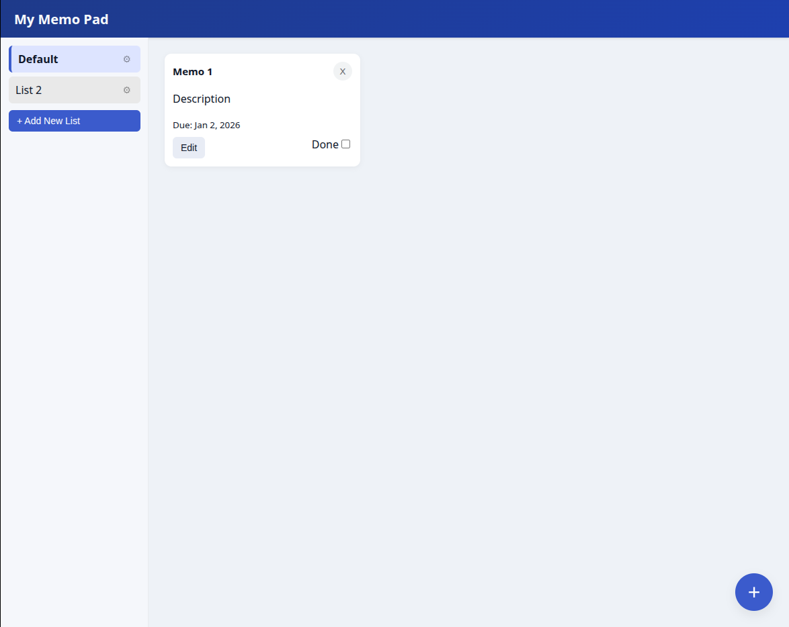

# Memo Pad App

シンプルなメモ管理アプリです。JavaScriptの学習用として作成しました。リストごとにメモを管理でき、データはブラウザのローカルストレージに保存されます。


---

## 機能

- リストの作成・切り替え
- メモの追加・編集・削除
- 期限日の設定
- メモの完了（Done）チェック
- ページを更新してもデータが残る（localStorage）
- スマートフォン対応

---

## 使用技術

- HTML / CSS
- JavaScript（ES Modules）
- localStorage
- date-fns（日時表示用）

---

## ディレクトリ構成

```
src/
├── index.js      # アプリの開始処理
├── dom.js        # 画面表示の更新
├── storage.js    # データ管理と保存
├── modal.js      # モーダル画面の処理
├── memo.js       # メモデータ作成
├── lists.js      # リストデータ作成
└── styles.css    # スタイル
```

---

## アプリの構成について

- データ管理は `storage.js` にまとめています
- 画面の表示更新は `dom.js` で行っています
- モーダルは1つだけ作り、用途ごとに使い回しています

難しい仕組みは使わず、処理の流れが分かりやすい構成を意識しました。

---

## 工夫した点

- ファイルを分けて、役割が分かるようにしました
- JavaScriptの基本（DOM操作、イベント、モジュール）を意識しています
- スマートフォンでも使いやすいレイアウトにしました

---

## 今後やってみたいこと

- メモの並び替え
- 完了メモの表示切り替え
- エラーチェックの追加

---

## 作成目的

JavaScriptの基礎を練習するために作成した個人制作です。

未経験エンジニアとして、コードを整理して書くことと、内容を説明できることを意識しています。

## Screenshot
